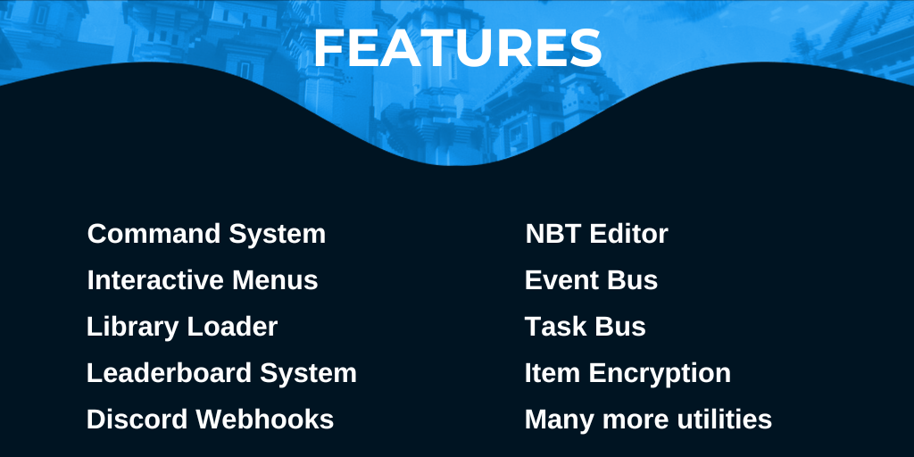

[](https://jd.alumina.dev) 

***

***


```xml
<repository>
    <id>Negative Games</id>
    <url>https://repo.negative.games/repository/maven-releases/</url>
</repository>
```
```xml
<dependency>
    <groupId>games.negative.alumina</groupId>
    <artifactId>alumina</artifactId>
    <version>1.5.1</version>
    <scope>compile</scope>
</dependency>
```

### Optional Shading
In case other software in your JVM is using this library, you should shade it into your jar and relocate it to your preferred namespace using the `maven-shade-plugin`.
```xml
<plugin>
    <groupId>org.apache.maven.plugins</groupId>
    <artifactId>maven-shade-plugin</artifactId>
    <version>3.5.0</version>
    <executions>
        <execution>
            <phase>package</phase>
            <goals>
                <goal>shade</goal>
            </goals>
            <configuration>
                <createDependencyReducedPom>false</createDependencyReducedPom>
                <relocations>
                    <relocation>
                        <pattern>games.negative.alumina</pattern>
                        <shadedPattern>[YOUR NAMESPACE].alumina</shadedPattern>
                    </relocation>
                </relocations>
            </configuration>
        </execution>
    </executions>
</plugin>
```
***

```groovy
maven { url 'https://repo.negative.games/repository/maven-releases/' }
```
```groovy
implementation("games.negative.alumina:alumina:1.5.1")
```
***

[](https://discord.gg/XnHEn6BB2j)
